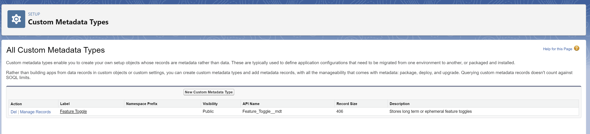
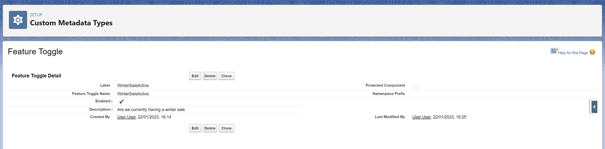

Feature Toggles
-------------------------------------------

With feature based development and continuous delivery or continuous deployment it is often necessary to be able to deploy new features to a select group of testers or customers.

Within Salesforce there are many ways to create feature toggles; typically, but not always, they will be implimented by one of the mechanisms below 

## Custom Settings
- A custom setting is a single object with fields
- Each field becomes a toggle
- Each field can have a default value
- Custom settings can be stored for the entire org or per profile
- If a custom setting does not exist or has not been configured the field defaults are used
- Deploying a custom setting is as easy as deploying a new sObject
- You cannot deploy custom setting values
- Custom setting values can be copied from org to org using the data loader

Using custom settings
- Supports nearly all Salesforce data types (not picklists)
- Easy to add new fields, i.e. toggles
- Very easy to consume, just instantiate the object and reference the field
- As an actual field is referenced it is hard to make any spelling mistakes or errors in the code
- Easy to mock in a unit test
- Not clear whether the fields, i.e. toggles can be easily removed once deployed

## Custom Metadata Types
- Custom metadata types are similar to an sObject, fields are declared on the type
- Custom metadata types contain many records
- Each custom metadata type record contains all of the fields declared on the type
- Unlike custom settings, custom metadata type records CAN be deployed to orgs
- If packaging a custom metadata type you can control who can make any changes after deployment or protect the records
- Custom metadata types have page layouts and can be embedded in Salesforce pages

Using custom metadata types
- Supports nearly all Salesforce data types including picklist and relationships to other custom metadata types
- Easy to add new fields
- Easy to add new records
- Easy to deploy records
- Extracting the data involves writing SOQL
- Custom metadata SOQL does not count towards the Salesforce execution governor limits
- Records whose values have been overridden may be reverted to the default values when re-deployed 
- Not very easy to mock or use in a unit test
- Not clear whether the records can be removed in a changeset

## Custom Permission and Permission Sets
- Custom permission is a single value that can be added in Salesforce
- The custom permission is added to a permission set
- A permission set is assigned to a user or profile

Using custom permissions
- add the permission to a permission set
- apply the permission set to a user, profile or group of users or profiles

Salesforce has facilities built in to interrogate whether a user has an appropriate permission using the FeatureManager class. 
ISV's have other options for long lived settings or features via the Licence Management Organization.

## Example: custom metadata type toggles

### Setting up
Push the code in this repository to your scratch org.

Open your Salesforce instance, click on the cog in the top right handside of the page and select “Setup”.

In the Salesforce settings enter "Custom Metadata" in the quick find box and select "Custom Metadata Types". Next to “Feature Toggle” select “Manage Records”. 



On the Feature Toggle record page click the “new” button, put your toggle name in the Label field, tab or mouse out of the field, the value entered in the Label field is copied to the Feature Toggle Name field, you can leave the toggle name or change it, select whether the feature is enabled or disabled, save the record.



The feature needs to be added to the FeatureToggles class in order to use it.

Open the FeatureToggles class, to avoid the use of magic strings add a static string reference with the value being the feature toggle name not the value of the label, create a property on the feature toggle class, the get method of the property needs to call the FeatureToggleProvider's getValueOrDefaultToFalse method passing in the toggle name. Code will be similar to the snippet below.

 ```Apex
 public class FeatureToggles { 
    public static final String WinterSaleOn = 'WinterSale'; 
    
    @TestVisible
    private static FeatureToggleProvider provider = new FeatureToggleProvider();
    
    public static Boolean winterSaleOn { 
        get { 
            return provider.getValueOrDefaultToFalse(WinterSaleOn);
        }
    }
}
```

It is possible to update the FeatureToggles class without referring to a valid custom metadata type record; in which case just return false if the feature is not active or true if the feature is active.

### Using your feature toggle
When referring to your feature toggle simply use the static property on the FeatureToggles class, similar to the snippet below

```Apex
 if (FeatureToggles.winterSaleOn == false) { 
    return;
}
``` 

### Unit Testing with feature on or off
Custom metadata is always available for Apex unit tests and does not require the [seealldata](https://developer.salesforce.com/docs/atlas.en-us.apexcode.meta/apexcode/apex_testing_seealldata_using.htm) attribute.

However modifying custom metadata type records directly in Apex is not a trivial task, the record values need to be changed using the metadata SOAP service. Wrappers to access the metadata SOAP service from Apex are widely available although they normally require a packages to be installed or boiler plate code to be added to the Salesforce solution. In lieu of boiler plate able to update the custom metadata type records there is a MockFeatureToggleProvider than can used to set the features on or off.

In order to use the MockFeatureToggleProvider create an instance of the MockFeatureToggleProvider, set the underlying FeatureToggles provider to the MockFeatureToggleProvider and set your features to be true (on) or false (off).

```Apex 
@IsTest 
public static void givenFeatureToggle() { 
    FeatureToggles.provider = new MockFeatureToggleProvider().setToggleFor(FeatureToggles.winterSale, true);
```
